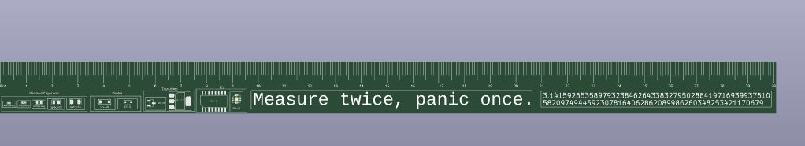

# PCBRULER
 THis is my first project in blueprint it is just a simple ruler
 
 I made it because i have always wanted a good ruler. I think it is also a good place to put references for smd sizes and like calculations. I also want to give one to one of my close friends as a birthday gift.
 
 Firstly I didnt touch the shematic because i didnt need to then i created the edge cuts and added the cm and mm lines. there is one line per mm and one larger line each 5mm there is a bigger line at 1cm. Then i added a quote that i liked which was "Measure twice, Panic once" i also added footprints on the left for me to esaily use when i am designing a pcb next time. I also added the first 100 digits of pi to the right side cause realistically i didnt know what to put there. 
 
 On the underside, I put my github link and my name and year i created this and also useful formulas and conversions to easily see when doing electronic projects in the future. Then i added a nutritional guideline table because i thought it was funny :) I also added a second QR code which leads to rick roll :)) All in all this is a very useful ruler for me as lots of my references are on here in one thing that i can easily carry around. 
 
On the top side, there is a 30cm ruler and some useful things those useful things include smd references, and for fun the first 100 digits of pi. THe underside has a qr code to my github and also some useful formulas.

### Update
The reviewer has said that i have to add some more usefulness to my ruler so i am going to add a rp2040 board and cascillated holes as pins. I am going to build in some rgbs, a oled and some bottons to chose which program to run. I might add a battery to it. So far i have done most of the schematic for the rp2040

### Bill of Materials (BOM)

| Item | Quantity | URL | Price (USD) |
|------|---------|-----|-------------|
| PCB | 5 | [Link](https://cart.jlcpcb.com/quote?orderType=1&homeUploadNum=6f552ba165f94ad8b5276539fe3203e9&businessType=example&fileName=PCB.zipA) | 9.81 |

